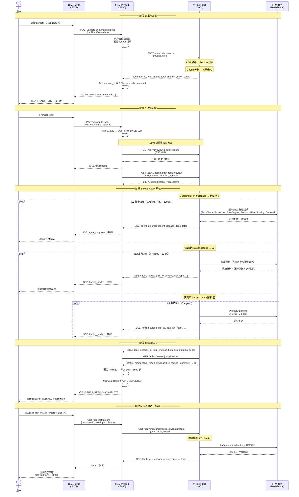
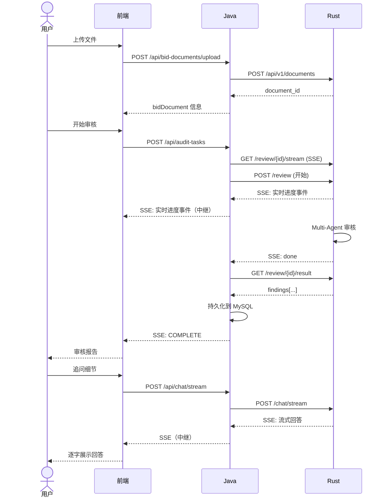

# Rust 引擎接口契约

> **定位：** Java 后端作为业务网关，Rust 后端作为 AI 引擎黑盒。  
> **最后更新：** 2026-07-03  
> **关联文档：** [Rust API 参考（backend-rust/docs/API参考.md）](../backend-rust/docs/API参考.md)

---

## 目录

1. [架构定位](#架构定位)
2. [接口契约](#接口契约)
3. [黑盒边界](#黑盒边界)
4. [接口列表（Java → Rust）](#接口列表java--rust)
5. [系统交互时序图](#系统交互时序图)
6. [数据类型映射](#数据类型映射)
7. [故障处理](#故障处理)

---

## 架构定位

```
┌─────────────────────────────────────────────────────────────┐
│                        Frontend (React)                      │
│                     localhost:5173 (dev)                     │
└──────────────────────────┬──────────────────────────────────┘
                           │ REST / SSE (via Vite proxy → :8080)
                           ▼
┌─────────────────────────────────────────────────────────────┐
│                   Java Backend (Spring Boot)                 │
│                     localhost:8080                           │
│                                                             │
│   ┌───────────┐  ┌──────────────┐  ┌──────────────────┐    │
│   │ 认证/鉴权  │  │  业务 CRUD    │  │  文件管理/知识库  │    │
│   │ (JWT)    │  │  (项目/招标)  │  │  (上传/下载)     │    │
│   └───────────┘  └──────────────┘  └──────────────────┘    │
│                          │                                   │
│               ┌──────────┴──────────┐                       │
│               │  AuditEngineService │  ← 编排层              │
│               │  (4 阶段流水线)      │                       │
│               └──────────┬──────────┘                       │
│                          │                                   │
│               ┌──────────┴──────────┐                       │
│               │  RustApiClient      │  ← HTTP 代理层         │
│               │  RustSseClient      │  ← SSE 中继层          │
│               └──────────┬──────────┘                       │
└──────────────────────────┼──────────────────────────────────┘
                           │ HTTP / SSE (内部网络，127.0.0.1)
                           ▼
┌─────────────────────────────────────────────────────────────┐
│                    Rust Engine (Axum)                        │
│                     localhost:3001                           │
│                                                             │
│   ┌───────────┐  ┌──────────────┐  ┌──────────────────┐    │
│   │ PDF 解析   │  │  向量嵌入     │  │ 语义搜索          │    │
│   └───────────┘  └──────────────┘  └──────────────────┘    │
│                                                             │
│   ┌──────────────────────────────────────────────────────┐  │
│   │              Multi-Agent 审核引擎                      │  │
│   │  10 Agent + Coordinator | 3 层审查 | SSE 实时推送      │  │
│   └──────────────────────────────────────────────────────┘  │
│                                                             │
│   ┌───────────┐  ┌──────────────┐                           │
│   │ RAG 对话   │  │  联网搜索     │                           │
│   └───────────┘  └──────────────┘                           │
└─────────────────────────────────────────────────────────────┘
```

### 职责划分

| 层 | 职责 | 不负责 |
|---|---|---|
| **Java** | 用户认证、项目管理、招标文件 CRUD、审核任务调度、SSE 中继、报告生成、结果持久化 | AI 推理、NLP、向量搜索、Agent 逻辑 |
| **Rust** | PDF 解析、文本分块、向量嵌入、Multi-Agent 审核、RAG 对话、语义搜索 | 用户管理、业务 CRUD、结果入库、报告格式 |

---

## 接口契约

### 核心原则

> **Rust 引擎 = 黑盒。Java 只关心"调用什么"和"返回什么"，不关心"怎么实现"。**

Java 侧与 Rust 引擎的交互严格遵循以下契约：

```
Java                          Rust
  │                             │
  │  HTTP Request (JSON)        │
  │ ─────────────────────────→ │
  │                             │  ← 内部：PDF 解析
  │                             │  ← 内部：Chunk 分割
  │                             │  ← 内部：向量嵌入
  │                             │  ← 内部：LLM 推理
  │                             │  ← 内部：Agent 调度
  │  HTTP Response (JSON)       │
  │ ←───────────────────────── │
  │                             │
  │  SSE Stream                 │
  │ ←─ ─ ─ ─ ─ ─ ─ ─ ─ ─ ─ ─ │  ← 内部：实时事件推送
```

### 通信协议

| 维度 | 约定 |
|---|---|
| 传输 | HTTP/1.1 |
| 格式 | JSON，`snake_case` 命名 |
| 流式 | SSE (Server-Sent Events)，标准协议 |
| 编码 | UTF-8 |
| 超时 | 连接 5s，读取 900s（审核最长 15 分钟） |

### 序列化约定

- Java 端使用 `PropertyNamingStrategies.SNAKE_CASE` 自动转换驼峰 ↔ 蛇形
- 所有 DTO 标记 `@JsonIgnoreProperties(ignoreUnknown = true)` 向前兼容
- Rust 端使用 `serde` + `rename_all = "snake_case"`

---

## 黑盒边界

### Java 知道的事（接口契约）

- Rust 引擎监听的地址和端口：`127.0.0.1:3001`
- 10 个 HTTP 端点的路径、方法、请求体、响应体
- SSE 事件的类型和数据结构
- 异步审核的 3 种状态：`pending` → `completed` / `failed`

### Java 不知道的事（实现细节）

- PDF 解析用什么库（`pdfplumber` vs `orbison`）
- 嵌入模型是 BGE-M3 还是 DashScope
- Agent 之间如何通信（Coordinator 路由算法）
- LLM 调用的 prompt 模板
- RAG 的检索策略和重排序逻辑
- 联网搜索用了哪个搜索引擎

### 配置入口

Java 通过 `application.yml` 配置 Rust 连接：

```yaml
rust:
  api:
    base-url: http://127.0.0.1:3001     # Rust 引擎地址
    connect-timeout-ms: 5000            # TCP 连接超时
    read-timeout-ms: 900000             # 响应读取超时（15 分钟）
    health-check-enabled: true          # 启动时是否检查 Rust 健康状态
```

### 配置项对应的 Rust 环境变量

| Java 关心什么 | Rust 怎么配置 |
|---|---|
| 审核质量 | `AIBID_AGENT=1`、`AIBID_COORDINATOR=1` |
| 嵌入速度 vs 精度 | `EMBED_ENGINE=local` \| `remote` |
| LLM 模型选择 | `AIBID_LLM_PROTOCOL=dashscope` \| `openai_compatible` |
| 搜索来源 | `AIBID_SEARCH_BACKEND=dashscope` \| `searxng` |
| 数据目录 | `AIBID_DATA_DIR` |

---

## 接口列表（Java → Rust）

Java 通过 `RustApiClient` 和 `RustSseClient` 调用以下 Rust 端点：

| # | Java 方法 | Rust 端点 | 调用时机 |
|---|-----------|-----------|----------|
| 1 | `healthCheck()` | `GET /health` | 应用启动时 |
| 2 | `uploadDocument(filePath, filename)` | `POST /api/v1/documents` | 用户上传招标文件 |
| 3 | `getDocument(documentId)` | `GET /api/v1/documents/{id}` | 检查文档是否已上传 |
| 4 | `startReview(docId, reviewReq)` | `POST /api/v1/documents/{id}/review` | 用户发起审核 |
| 5 | (RustSseClient) | `GET /api/v1/review/{docId}/stream` | SSE 中继审核进度 |
| 6 | `getReviewResult(documentId)` | `GET /api/v1/review/{docId}/result` | 审核完成/失败后获取结果 |
| 7 | `chatWithDocument(docId, chatReq)` | `POST /api/v1/documents/{id}/chat` | 用户与文档对话 |
| 8 | `connectChatStream(docId, chatReq, callback)` | `POST /api/v1/documents/{id}/chat/stream` | 流式对话 |
| 9 | `searchDocument(docId, searchReq)` | `POST /api/v1/documents/{id}/search` | 知识库语义搜索 |
| 10 | `getBlockBboxes(docId, blockIds)` | `GET /api/v1/documents/{id}/blocks` | 前端 PDF 高亮定位 |

### 审核任务编排流水线

Java 的 `AuditEngineServiceImpl` 编排 4 阶段审核流程：

```
阶段 1: Upload
  检查 Tender.rustDocumentId 是否已有值
    ├─ 有 → 跳过（幂等，已缓存）
    └─ 无 → RustApiClient.uploadDocument()
             → 将返回的 documentId 写入 Tender.rustDocumentId

阶段 2: Review
  RustSseClient.connect(reviewStreamUrl)    ← 先连接 SSE
  RustApiClient.startReview(docId, req)      ← 再发起审核
  RustSseClient 接收事件 → SseHub 广播给前端

阶段 3: Map Findings
  等待 SSE "done" 事件
  RustApiClient.getReviewResult(docId)
  遍历 RustRiskFinding → IssueVO → 写入 audit_issue 表
  通过 SseHub 推送 ISSUES_READY 事件

阶段 4: Complete
  更新 AuditTask 状态为 COMPLETED
  通过 SseHub 推送 COMPLETE 事件
```

---

## 系统交互时序图

### 关键路径：上传 → 审核 → 结果



### 简化版时序图（关键节点）



---

## 数据类型映射

### Java DTO ↔ Rust Struct 对应关系

Java DTO 位于 `model/dto/rust/`，与 Rust 侧的 `struct` 字段一一对应：

| Java DTO | Rust Struct | 用途 |
|---|---|---|
| `RustProcessResponse.java` | `ProcessResponse` | 文档上传响应 |
| `RustDocumentInfo.java` | `DocumentInfo` | 文档状态查询 |
| `RustReviewRequest.java` | `ReviewRequest` | 审核请求 |
| `RustReviewAcceptedResponse.java` | `ReviewAccepted` | 审核受理 |
| `RustReviewResultResponse.java` | `ReviewResultResponse` | 异步审核结果包装 |
| `RustReviewResponse.java` | `ReviewResult` | 审核结果详情 |
| `RustRiskFinding.java` | `RiskFinding` | 单条风险发现 |
| `RustRoutingSummary.java` | `RoutingSummary` | Coordinator 路由统计 |
| `RustChatRequest.java` | `ChatRequest` | 对话请求 |
| `RustChatResponse.java` | `ChatResponse` | 对话响应 |
| `RustSearchRequest.java` | `SearchRequest` | 语义搜索请求 |
| `RustSearchResponse.java` | `SearchResponse` | 语义搜索响应 |
| `RustBlockBBoxResponse.java` | `BlockBBoxResponse` | 块边界坐标 |

### 命名约定

```
Rust (snake_case)              Java (camelCase)
─────────────────              ─────────────────
document_id          ←──→      documentId
total_pages          ←──→      totalPages
risk_type            ←──→      riskType
source_quote         ←──→      sourceQuote
legal_basis          ←──→      legalBasis
max_clauses          ←──→      maxClauses
top_k                ←──→      topK
```

Java 的 ObjectMapper 统一配置：
```java
objectMapper.setPropertyNamingStrategy(PropertyNamingStrategies.SNAKE_CASE);
```

---

## 故障处理

### Java 侧的容错策略

| 故障场景 | 处理方式 |
|---|---|
| Rust 进程未启动 | 健康检查失败 → 启动日志告警；API 调用返回 503 给前端 |
| Rust 上传失败（500） | 重试 1 次 → 仍失败则返回错误给前端 |
| Rust SSE 连接断开 | `RustSseClient` 自动重连（指数退避，最多 3 次） |
| Rust 审核超时（>15min） | HTTP 读取超时 → 标记任务 FAILED → 通知前端 |
| Rust 重启后内存数据丢失 | `getReviewResult()` 返回 404 → Java 回退到 `audit_issue` 表查询 |
| Rust 返回未知字段 | `@JsonIgnoreProperties(ignoreUnknown = true)` 忽略，向前兼容 |

### 状态一致性

```
Rust 审核状态              Java AuditTask 状态
─────────────              ──────────────────
(无)                ←──→   PENDING
运行中               ←──→   PROCESSING
completed           ←──→   COMPLETED
failed              ←──→   FAILED
```

Java 作为状态的真实来源（Source of Truth），因为 Rust 是无状态的内存服务。审核结果通过 Java 持久化到 MySQL `audit_issue` 表。

---

## 接口契约版本管理

| 版本 | 日期 | 变更 |
|---|---|---|
| v1.0 | 2026-07-03 | 初始版本，10 个端点 |

**契约变更原则：**
- Rust 新增字段 → Java 通过 `ignoreUnknown = true` 自动兼容
- Rust 修改字段含义 → 需同步更新 Java DTO 和本文档
- Rust 新增端点 → Java 在 `RustApiClient` 中添加对应方法，更新本文档
- Rust 删除端点 → 先标记 Deprecated，2 个版本后删除
