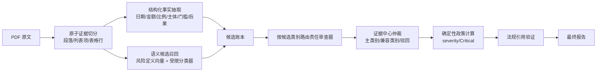

# 下一轮泛化能力改造方案

日期：2026-07-27  
依据：blind test-v2（TP=21、FP=16、FN=9、F1=62.69%、Critical Recall=30%）

## 1. 结论

下一轮不应继续向 Prompt 和关键词表追加 blind-v2 的原句。正确方向是把系统从
“关键词路由多个 Agent，各自自由判断，再按文本去重”改成
“原子证据切分、高召回候选生成、候选责任制验证、证据中心裁决、确定性政策计算”。

可以增强泛化，但需要修改审核决策链，而不是只修一个 Agent。

## 2. 已确认的根因

### 2.1 审核顺序反
当前顺序是：

1. 根据章节/文本关键词决定调用哪些 Agent；
2. Agent 启动后，才计算规则候选并注入给该 Agent。

这会导致真正的责任 Agent 根本没有机会看到候选。

BLIND-003 包含无关荣誉资格、厂家授权资格和单方无限变更，实际只路由到
RuleEngine 和 FactCheck，没有路由到 Demand、Procedure、Contract，最终 0/3。

### 2.2 关键政策仍依赖窄关键词

Critical 的类别归一化已经存在，但证据谓词仍直接匹配字面词：

- 认识“品牌”，不认识“厂牌/系列/指定产品”；
- 认识“本省”，不认识“所在省份/采购人辖区”；
- 认识“注册资本”，不认识“实缴资本/主营业务收入”。

所以 10 条 Critical 中 7 条被发现，只有 3 条被标为 Critical。

### 2.3 审核单位过粗

审核单位仍是约千字 chunk。注入页可能与原文件上一节合并，Agent 会同时看到大量履约保函、
格式说明和三条独立风险，造成注意力偏移与错误归类。

应把向量检索 chunk 与审核证据单元分开：检索可以用大 chunk，审核必须使用段落、列表项、
表格行等原子条款。

### 2.4 “多 Agent”缺少最终类别仲裁

目前去重主要处理“同类别 + 同条款 + 相似证据”。同一证据被不同 Agent 报成不同类别时会全部保留。

blind-v2 中出现：

- 规模门槛同时报成无关资格、保证金过高；
- 主观评分同时报成验收模糊、违约责任；
- 单方新增需求同时报成日期冲突、知识产权、其他风险。

这直接形成 16 条 FP。

### 2.5 法规搜索过早

Agent 在事实分类之前大量联网搜索。BLIND-008 技术补跑有 31 次 LLM 调用、21 次知识搜索，
浪费调用比例 81%，最终输出 6 条但只有 3 条命中。

事实是否存在和引用哪条法律是两个问题。应先基于原文确定事实和类别，再为已确认问题补法规。

### 2.6 盲点扫描不保护当前结果

BlindSpot 在主结果返回后异步运行，只为下一次生成动态 Agent，不能补救本次漏检。
自动把模型生成的 Agent 写入运行目录还会引入版本漂移和 Benchmark 污染。

### 2.7 补扫触发依赖格式，不依赖真实覆盖

当前第二遍补扫主要在 `has_more=true`、首轮已输出5条，或检测到多个阿拉伯数字编号但发现数不足时触发。
“补充条款一/二/三”、表格行、项目符号等格式不会稳定触发；首轮输出 0 条也可能直接结束。

应由候选账本中的未决项触发补扫，而不是由编号格式或 finding 数量猜测是否漏检。

## 3. 目标架构



核心原则：

- 路由由候选类别决定，不能只由章节关键词决定。
- `is_critical` 是计算字段，模型和 Debate 不得直接写最终值。
- 每个候选都有状态：待审、成立、驳回、证据不足；不能无声消失。
- 同一证据先仲裁类别，再进入最终去重。
- 法规验证只能影响引用质量，不能因为搜索失败就删除已经成立的事实风险。

## 4. 分层设计

### 4.1 原子证据层

新增 `EvidenceSpan`：

- document_id、page、block_id、char_start、char_end；
- 原文和脱敏文本；
- section_path；
- 前后文引用；
- 结构类型：paragraph/list_item/table_row/cell_pair。

向量检索 chunk 保持不变，但审核时按 `EvidenceSpan` 运行。跨段问题通过 `context_group_id` 关联，
避免把多个独立事实塞进一个大文本。

### 4.2 高召回候选层

采用三路召回并集：

1. 确定性规则：日期、金额、比例、地域词、资格后果、唯一品牌、无限责任等；
2. 语义检索：将原子条款与风险定义、正例和反例做向量相似度 Top-K；
3. 受限候选分类器：批量输出 `candidate_codes[] + evidence_span + required_context`，
   只能从统一枚举选择，不输出最终严重度。

候选层优化目标是 Recall，不负责最终定罪。允许多召回，后续验证层负责 Precision。

### 4.3 候选账本与责任路由

每个候选写入：

- candidate_id；
- canonical_category；
- evidence_span_ids；
- generated_by；
- owner_agent；
- secondary_verifier；
- status；
- rejection_reason；
- extracted_features。

路由规则为 `category -> owner`。例如：

- SHORT_DEADLINE -> Procedure；
- BRAND_LOCK/SCALE_THRESHOLD -> Demand；
- REGIONAL_PERFORMANCE -> SemanticRisk；
- UNILATERAL_CHANGE -> Contract。

当规则层已经命中高信号候选时，责任 Agent 必须给出“成立”或“驳回 + 理由”，不能返回空数组。

### 4.4 结构化事实与确定性规则

为高价值类别建立事实模型：

- `DeadlineFact`：采购方式、文件提供时间、截止时间、间隔天数；
- `DepositFact`：预算、保证金、比例、支付形式；
- `QualificationFact`：条件、条件类型、适用主体、失败后果；
- `BrandFact`：品牌/系列/型号、是否允许同等产品；
- `RegionalFact`：地域范围、注册/业绩/奖项、资格或加分后果；
- `ContractFact`：权利主体、变更范围、费用/工期调整、责任上限；
- `DateEventFact`：事件类型、日期时间、来源位置。

确定性规则示例：

- 公开招标且准备期小于 20 日 -> SHORT_DEADLINE；
- 投标保证金 / 预算 > 2% -> EXCESSIVE_DEPOSIT；
- 同一事件存在两个互斥时间 -> CONFLICTING_DATES；
- 指定产品且 `equivalent_allowed=false` -> BRAND_LOCK；
- 经营规模指标作为资格失败条件 -> SCALE_THRESHOLD。

这些规则对“2026-08-03 到 2026-08-15”“十二个自然日”等表达做日期和中文数字解析，
不要求原文自己出现“期限不足”或“日期矛盾”。

### 4.5 证据中心仲裁

按重叠证据跨度聚合所有 Agent 输出，形成一个 `EvidenceCase`。

仲裁器输出：

- primary_category；
- optional_compatible_categories；
- rejected_categories；
- 每个结论对应的独立证据跨度。

建立类别兼容矩阵：

- BRAND_LOCK 与 OEM_AUTHORIZATION 可同时存在，但必须各有独立事实；
- SCALE_THRESHOLD 与 UNRELATED_CERT 通常互斥，同一资格条件选择更具体类别；
- SUBJECTIVE_SCORING 与 VAGUE_ACCEPTANCE 通常作用阶段不同，不能仅因措辞相近共存；
- OTHER 只有无法映射已知类别且有独立证据时允许保留。

### 4.6 Critical 与严重度政策

统一 taxonomy 数据文件，包含：

- canonical code；
- 中文名称；
- owner；
- 定义；
- hard negatives；
- required feature schema；
- severity policy；
- critical predicate；
- compatible/incompatible categories；
- 法规映射。

Rust、Python 评分器、Java 和前端均由这一份 taxonomy 生成或读取，禁止各维护一套。

Critical 根据结构化特征计算，例如：

```text
BRAND_LOCK:
  eligibility_or_rejection_effect = true
  equivalent_allowed = false
  => is_critical = true
```

最后输出前必须重新运行 PolicyEngine。LegalVerify 和 Debate 无权直接保存最终 `is_critical`。

### 4.7 法规验证后置

先完成：

`证据 -> 事实 -> 类别 -> 结论`

再执行：

`类别 + 事实 -> 法规映射 -> 官方来源校验`

法规搜索失败时标记 `citation_status=unverified`，不能把真实风险静默降为 Info。

### 4.8 自学习治理

BlindSpot 只生成离线提案：

- 不自动激活动态 Agent；
- 提案进入人工审核；
- 通过后进入版本化 taxonomy 或测试集；
- 每次运行记录 taxonomy_version、prompt_version、model_version；
- Benchmark 模式禁止任何运行时自修改。

## 5. 分阶段实施

### Phase 0：正确性止血，2-3 天

- Critical 改为最终统一计算；
- 补充结构化同义概念，不直接追加 blind-v2 原句；
- 日期间隔、保证金比例、日期冲突增加确定性验证器；
- LegalVerify 不再修改风险存在性；
- 增加 Critical 变体与边界单测。

目标：Critical policy 单测 100%，H01 候选召回 100%。

### Phase 1：候选先于路由，3-4 天

- 在 Coordinator 路由前运行候选生成；
- 候选直接路由 owner 和 secondary verifier；
- 建立候选账本和未决候选出口检查；
- 章节关键词仅作为补充信号。

目标：blind-v2 30 条的候选层 Recall >= 96%，不看最终分类成绩。

### Phase 2：原子证据与证据仲裁，4-6 天

- 实现 EvidenceSpan；
- 将审核单位从大 chunk 改为原子条款；
- 实现 EvidenceCase、主类别选择和兼容矩阵；
- 删除同证据跨类别自由堆叠。

目标：blind-v2 FP 从 16 降到不超过 7，Precision >= 75%。

### Phase 3：语义候选与校准，3-5 天

- taxonomy 定义向量召回；
- 批量受限候选分类器；
- 正例、反例和困难负例；
- 按规则命中、双模型一致性、证据完整度计算系统置信度。

目标：blind-v2 F1 >= 80% 仅作为开发目标。

### Phase 4：新盲测，3-5 天

- blind-v2 转为开发/回归集，不再作为盲测；
- 另建来源、表述和排版都未见过的 blind-v3；
- 一次冻结、一次正式运行；
- 连续两套盲测通过才建议上线。

单人预计 15-23 个有效开发日；两人并行约 10-15 个工作日。

## 6. 质量与成本预期

### 质量

- Recall：候选先于路由和覆盖账本会显著降低整块漏检；
- Precision：证据中心仲裁会减少同一句话多类别误报；
- Critical：结构化政策计算消除同义措辞导致的标记丢失；
- 可解释性：每个结论都有事实、候选、验证、仲裁和政策记录。

### 成本

当前 blind-v2 10 份注入页使用 159 次 LLM 调用，约 ¥0.48。

新架构增加本地规则、事实解析和向量召回，成本接近零；减少多 Agent 无目标搜索。
正常模式只调用 owner verifier，分歧或高风险才调用 secondary/adjudicator。

建议先设置：

- 标准模式成本不超过现版 1.2 倍；
- 深度模式不超过现版 1.8 倍；
- wasted_call_ratio < 35%；
- 法规搜索调用数降低 50% 以上。

不能先承诺一定降本，但架构方向同时有利于质量和成本，因为它减少无目标 Agent 扇出和重复搜索。

## 7. 验收门槛

上线前同时满足：

- candidate recall >= 98%；
- final Precision >= 75%；
- final F1 >= 80%；
- Critical detection recall >= 95%；
- Critical marking recall >= 95%；
- Critical precision >= 80%；
- 关键确定性规则单测 100%；
- 0 个未决 candidate 静默退出；
- 两个互不参与调优的 blind 集连续通过；
- 高风险结论仍保留人工复核流程。
